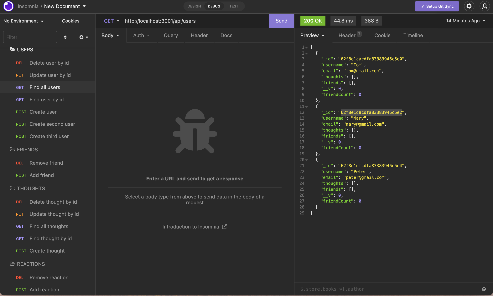

# Social Network API

## This is the repository for the Social Network API

## Table of Contents

- [Description](#description)
- [Installation](#installation)
- [Usage](#usage)
- [Screenshot and the Walkthrough Video](#screenshot-and-the-walkthrough-video)
- [Teachologies Used](#technologies-used)
- [License](#license)
- [Contact Me](#contact-me)

### Description

An API for a social network web application where users can share their thoughts, react to friends’ thoughts, and create a friend list.

### Installation

```
git clone git@github.com:angelawong3/social-network-api.git
cd social-network-api
npm install
```

### Usage

```
node index.js
or
npm run start
```

### Screenshot and the Walkthrough Video


<br />
Download the walkthrough video [here]()

### Technologies Used

1. JavaScript
2. Node.js
3. Express.js
4. MongoDB
5. Mongoose ODM
6. Moment.js

### License

[](https://opensource.org/licenses/MIT)

### Contact Me

Please contact me at angelawong3@yahoo.com

---

© 2022 Angela Wong
